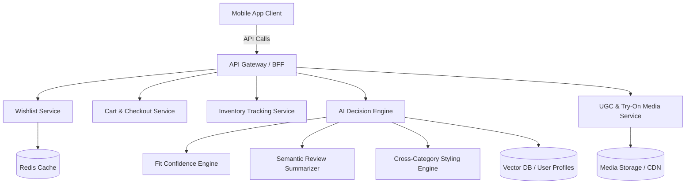

# Architecture Plan: Myntra In-Wishlist Decision Assistant (MVP)

## 1. Executive Summary
This document outlines the technical architecture for the **Myntra In-Wishlist AI Fit & Decision Assistant** MVP. The goal is to transform the wishlist from a passive storage area into an active decision-support tool, improving the 30-day wishlist-to-purchase conversion rate (WPCR) and increasing Average Order Value (AOV).

## 2. High-Level Architecture Diagram
The architecture follows a microservices-based approach with a dedicated Backend-For-Frontend (BFF) to ensure low latency and optimized payload delivery for mobile clients.

## 3. Core System Components

### 3.1. Client Application (Frontend)
- **UI Components:**
  - **Contextual In-Wishlist AI Banner:** A lightweight, highly responsive component that renders on top of wishlisted items.
  - **Bottom-Sheet Decision Drawer:** A swipeable component containing curated UGC, review summaries, and styling recommendations.
  - **One-Tap Cart CTA:** Integrated "Select Size & Move to Bag" button within the drawer.
- **Optimization:** To meet the 500ms P95 latency guardrail for the AI banner, the client will eagerly fetch or utilize pre-fetched banner data when the user navigates to the Wishlist tab.

### 3.2. Backend Services
- **Backend-For-Frontend (BFF):** Aggregates responses from the AI Service, Inventory, and UGC services to minimize client round-trips.
- **AI Decision Engine (Microservice):**
  - *Fit Confidence Engine:* Compares user body profile data against product metadata and sizing charts to calculate a 0-100% fit score.
  - *Semantic Review Summarizer:* Processes raw product reviews using NLP to extract key attributes (fabric stretch, durability, fit nuances) into dynamic consensus highlights.
  - *Styling Recommendation Engine:* Generates cross-category styling suggestions by analyzing the user's existing wardrobe and wishlist items using collaborative filtering and item-to-item similarity.
- **UGC & Media Service:** Curates and serves real-body try-on photos matching the user's sizing and body parameters.
- **Inventory Tracking Service:** Provides real-time stock levels to trigger size-depletion alerts and ensure the One-Tap Cart Conversion flow succeeds.

### 3.3. Data Storage & Caching
- **Redis Cache:** Critical for meeting the strict latency budget (P95 <= 500ms). Pre-computes and caches Fit Confidence Scores and Semantic Summaries for high-traffic wishlist items asynchronously.
- **Vector Database:** Stores user body profiles and product embeddings for fast semantic matching (for UGC discovery and styling recommendations).
- **Document Store (NoSQL):** Stores the generated AI review summaries and UGC metadata.

## 4. Key Data Flows

### 4.1. Rendering the In-Wishlist AI Banner (< 500ms Latency)
1. User opens the Wishlist tab.
2. Client requests wishlist items from the BFF.
3. BFF queries the `Wishlist Service` (for items) and `Cache` (for pre-computed Fit Scores and Consensus Highlights).
4. **Fallback:** If a cache miss occurs, the BFF asynchronously triggers the `AI Decision Engine` to compute the score in the background, serving fallback UI initially to maintain strict latency guardrails.
5. BFF returns aggregated data to the client to render the Banner.

### 4.2. Opening the Bottom-Sheet Decision Drawer
1. User taps on the AI Banner for a specific item.
2. Client requests deep-dive details from the BFF.
3. BFF queries:
   - `UGC Service` for real-body photos matching the user's parameters.
   - `AI Decision Engine` for the detailed Semantic Review Summary and Styling Recommendations.
   - `Inventory Service` for real-time size availability.
4. Data is aggregated and streamed to the client for immediate rendering of the Drawer.

### 4.3. One-Tap Cart Conversion
1. User selects a size and taps "Move to Bag" in the Decision Drawer.
2. Client sends an add-to-cart request to the BFF.
3. BFF verifies inventory with the `Inventory Tracking Service`.
4. If available, the item is added via the `Cart Service` and removed from the `Wishlist Service`.
5. Success response updates the UI seamlessly without page reloads.

## 5. Technology Stack Recommendations
- **Frontend:** React Native (iOS & Android) for cross-platform UI components.
- **Backend Services:** Node.js or Go for high-concurrency API Gateway/BFF; Python for AI/ML microservices.
- **AI/NLP Models:** Transformer-based LLMs (e.g., Llama 3 or OpenAI APIs) for semantic summarization; fine-tuned embeddings for fit and styling matching.
- **Databases:** Redis (Caching), Pinecone/Milvus (Vector DB), MongoDB/DynamoDB (UGC and Summaries).
- **Infrastructure:** Kubernetes on AWS/GCP for auto-scaling during peak fashion sale events (e.g., Myntra EORS).

## 6. Success Metrics & Guardrails Tracking
- **Instrumentation:** Implement comprehensive telemetry to track the North Star Metric (30-Day WPCR) and secondary metrics (AOV, return rates).
- **Latency Monitoring:** Set up Datadog or Prometheus alerts to monitor the P95 latency budget (<= 500ms) for the AI banner endpoint, ensuring no degradation in user experience.
